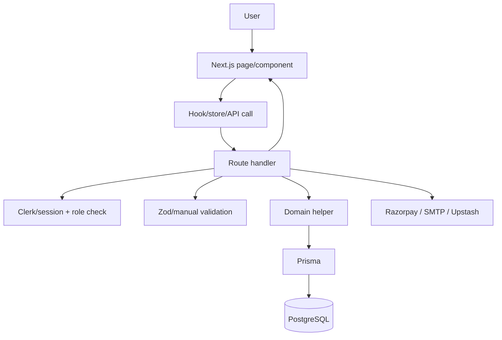

# System architecture

EventHub is a layered modular monolith. Browser pages and client components call same-deployment route handlers. Route handlers resolve identity/roles, validate input, use domain helpers, access Prisma, and call external services. The database is shared by all roles and flows.

No separate repository or service class layer is consistently present; many route handlers contain orchestration and direct Prisma operations.
