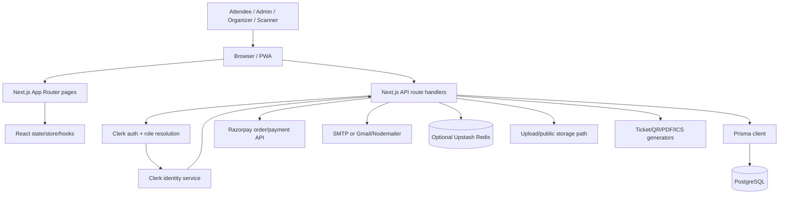
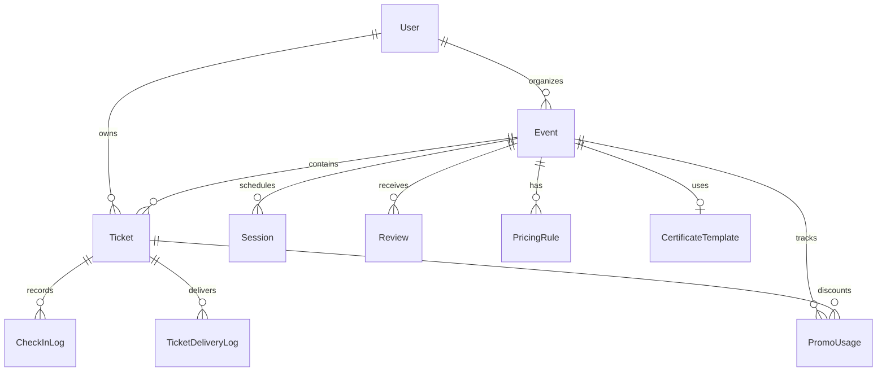

# EventHub: Master Project Documentation

> Reverse-engineered from the current repository. Source code and executable configuration are authoritative. Claims are marked **CONFIRMED**, **INFERENCE**, or **UNKNOWN** where needed. Secrets are intentionally omitted.

## 1. Executive summary

EventHub is a single Next.js 16 App Router application for discovering events, creating and managing events, selling tickets, accepting Razorpay payments, delivering tickets, checking attendees in with QR codes, and operating the platform through Admin, Organizer, and Scanner roles. It uses React 19, TypeScript, Prisma 6, PostgreSQL, Clerk, optional Upstash Redis rate limiting, SMTP/Nodemailer, and client-side/PWA capabilities.

The application is a **modular monolith**, not a microservice system. UI pages, server-rendered logic, API route handlers, and integration code live in one deployable Next.js unit. PostgreSQL is the system of record. Clerk is the identity provider; local `User` rows mirror role and event-assignment data. Razorpay is used for payment order creation, signature verification, and payment lookup. Ticket and QR integrity use HMACs.

No AI/LLM, vector database, agent, queue, worker, cron implementation, payment webhook, or analytics vendor was identified in the current source. Analytics are calculated through application API routes and database queries.

## 2. What the project actually does

### Confirmed behavior

- Public pages expose the home/discovery surface, event details, public event slug pages, registration, ticket viewing, and sign-in/sign-up flows.
- Authenticated roles are resolved from Clerk organization role first and Clerk public metadata/local user role as the fallback path (`lib/clerk-role-utils.ts`, `lib/auth.ts`).
- Admins manage users, events, settings, pricing rules, promo codes, scanners, audits, certificates, and cross-event analytics.
- Organizers manage permitted events and attendee/ticket workflows.
- Scanners access check-in workflows for assigned events.
- Tickets move through pending, paid, cancelled, refunded, partially-refunded, and derived checked-in states.
- Paid ticket capacity is protected with transactional conditional updates to `Event.soldCount`.
- Ticket URLs can be authorized through HMAC-derived ticket tokens, ticket ownership, or an event manager session.
- Timed QR payloads are HMAC signed and valid for five minutes; check-in logs include a checksum for tamper evidence.

### Discrepancies and limits

- The README describes a broad “production-oriented SaaS” and “venue management,” but the implementation is a specific event platform whose venue data is stored as fields on `Event`; no separate venue entity exists.
- The README mentions “automated” email, but delivery depends on SMTP/Gmail environment configuration and failures are recorded or logged rather than guaranteed.
- The Prisma schema has no migration directory in the checkout; setup documentation uses `prisma db push`. This means schema lifecycle/versioned migration evidence is **not determinable from the repository**.
- `proxy.ts` allows API routes to proceed to route handlers; route-level authorization must therefore be audited independently.
- `app/api/email/send.ts` and `app/api/email/send-certificate.ts` appear public-ish from their implementation markers and deserve targeted authorization review.

## 3. Architecture



### Layer map

| Layer | Implementation | Responsibility |
|---|---|---|
| Presentation | `app/**/page.tsx`, `components/**` | Pages, forms, dashboards, scanning, loading/error UI |
| Client state | `lib/store`, hooks | App UI state, offline check-in support, scan feedback |
| Transport | `app/api/**/route.ts` | HTTP methods, parsing, status codes, integration orchestration |
| Cross-cutting | `proxy.ts`, `lib/auth.ts`, `lib/api-helpers`, `lib/rate-limit.ts` | Middleware redirects, session/role checks, validation, throttling |
| Domain helpers | `lib/pricing.ts`, `ticket-lifecycle.ts`, `ticket-access.ts`, `qr-security.ts` | Pricing, state, access, QR integrity |
| Persistence | `lib/prisma.ts`, `prisma/schema.prisma` | PostgreSQL access and models |
| Integrations | `lib/email.ts`, `ticket-email.ts`, `sms.ts`, Razorpay routes | External delivery/payments |
| Delivery | Vercel config, Next build/PWA | Deployment and installable web app |

## 4. Repository map

```text
app/                 App Router pages, layouts, error boundaries, API routes
components/          Reusable UI and Admin/Organizer feature components
hooks/               Client hooks: offline check-in, drag, scan feedback
lib/                 Auth, Prisma, domain logic, security, integrations, exports
prisma/schema.prisma PostgreSQL data model
prisma/seed.ts       SiteConfig and demo-event seed
scripts/              Tests, env checks, data repair/backfill utilities
public/               Images, sounds, manifest, PWA/service-worker assets
proxy.ts              Clerk middleware and route redirects
next.config.ts       PWA and image configuration
vercel.json           Next.js/Vercel region configuration
```

Important files: `proxy.ts`, `lib/auth.ts`, `lib/api-helpers/index.ts`, `lib/prisma.ts`, `prisma/schema.prisma`, `lib/pricing.ts`, `lib/ticket-security.ts`, `lib/qr-security.ts`, `app/api/tickets/route.ts`, `app/api/razorpay/verify/route.ts`, `app/api/checkin/route.ts`, `components/QRScanner.tsx`, `lib/store/index.tsx`.

## 5. Roles and authorization

The application roles are `ADMIN`, `ORGANIZER`/legacy `ORGANISER`, `SCANNER`, and `UNAUTHORIZED`. Admin is global. Organizer and scanner access is narrowed by `assignedEventIds` in the local/Clerk user metadata. `proxy.ts` protects page navigation and redirects users; `respond()` and route-specific checks protect API operations. Frontend visibility is not the security boundary.

```mermaid
flowchart TD
  C[Clerk user/session] --> R[resolveRole(orgRole, publicMetadata.role)]
  R --> A[ADMIN: platform + all events]
  R --> O[ORGANIZER: assigned event management]
  R --> S[SCANNER: assigned event check-in]
  R --> X[UNAUTHORIZED: /unauthorized]
  O --> E[hasEventAccess]
  S --> E
```

## 6. Main user workflows

### Discovery and registration

`app/page.tsx`/`components/HomeClient.tsx` loads public event/site data → attendee opens `app/event/[id]/page.tsx` or `app/p/[slug]/page.tsx` → registration form captures attendee data/custom answers → `POST /api/tickets` creates pending ticket rows → optional `POST /api/promo/validate` validates a code → `POST /api/razorpay/order` creates a Razorpay order, or free/promo checkout settles locally → browser completes payment → `POST /api/razorpay/verify` verifies signature and gateway status, marks tickets paid transactionally, increments capacity, generates token, and attempts email delivery.

### Check-in

Scanner uses `components/QRScanner.tsx` → `lib/scan-payload.ts` accepts ID/token, URL, JSON, or timed QR format → `POST /api/checkin` validates ticket/token/timed QR, role/event access, lifecycle and duplicate state → transaction updates `Ticket.checkedIn` and creates `CheckInLog` with HMAC checksum → response drives sound/toast/scan feedback. `hooks/useOfflineCheckin.ts` provides client-side offline queue behavior; server synchronization remains the authoritative operation.

### Event operations

Admin/Organizer page → event form/modal → `POST/PATCH /api/events` → validated event fields and JSON schedule/registration fields persist through Prisma → sessions/slots use event-specific routes → attendees, exports, reviews, analytics and ticket counters consume those records.

### Ticket delivery

Paid/free settlement → `lib/ticket-email.ts` and `lib/pdf-generator.ts` generate a ticket link/document → SMTP/Nodemailer sends email when configured → `TicketDeliveryLog` records delivery status where the calling path persists it. Ticket PDF/QR/ICS routes authorize using token, owner, or manager access.

## 7. Data model



Models: `AuditLog`, `User`, `Event`, `PricingRule`, `Review`, `Session`, `SiteConfig`, `Ticket`, `CheckInLog`, `TicketDeliveryLog`, `SecurityEvent`, `PromoCodeRecord`, `PromoUsage`, `CertificateTemplate`. `SiteConfig` is a singleton keyed by `default`. `Event` stores schedule, speakers, sponsors, tags, and registration fields as JSON/arrays rather than normalized child tables. `PromoCodeRecord.eventIds` is an array, not a foreign-key relation.

## 8. Ticket, pricing, and payment logic

Prices are integer minor units (the code treats event prices as paise; fixed pricing-rule UI values are multiplied by 100). `calculateTicketUnitPrice()` gives an active early-bird price before its deadline; otherwise `calculateDynamicPrice()` applies active time/demand rules cumulatively. Promo percentage discounts are clamped to 0–100%; fixed discounts are capped at subtotal. `allocatePaidAmount()` splits totals across tickets and distributes remainder to earlier indices.

`POST /api/razorpay/verify` checks required values, HMAC signature, Razorpay payment order/status, order-ticket consistency, and frozen amount totals. A transaction updates only pending tickets, increments `soldCount` with a capacity condition, creates promo usage, and makes repeated verification effectively idempotent for already-paid tickets. A payment webhook was not identified; verification is browser/API initiated.

## 9. Security audit

### Controls confirmed

- Clerk middleware and server-side Clerk API lookup are used for identity/role resolution.
- API helper supports standardized 401/403/400/404/409/500 responses and Zod parsing.
- Payment signatures use HMAC and timing-safe comparison; gateway status and order association are checked.
- Ticket tokens, timed QR values, and audit checksums use HMAC; production requires `TICKET_SECRET_KEY`.
- Optional Upstash sliding-window rate limiting is used by selected public-sensitive flows.
- Secrets are read from environment variables and are not documented here.

### Findings

| Severity | Finding | Evidence / impact |
|---|---|---|
| HIGH | Public-ish email endpoints need explicit authorization and abuse review | `app/api/email/send/route.ts`, `app/api/email/send-certificate/route.ts`; arbitrary sending or certificate delivery could become spam/data-exposure paths if not internally constrained |
| HIGH | QR HMAC is truncated to 16 hex characters | `lib/qr-security.ts`; increases online forgery probability versus a full digest, especially if rate limiting/check-in controls fail |
| MEDIUM | Development fallback ticket secret is deterministic | `lib/ticket-security.ts`; safe only for local development, and production correctly throws when missing |
| MEDIUM | Rate limiting is disabled when Upstash variables are absent | `lib/rate-limit.ts`; sensitive public endpoints lose throttling without operational configuration |
| MEDIUM | Middleware intentionally lets API requests through | `proxy.ts`; every route must enforce its own API authorization, and marker-based inventory found public-ish routes needing review |
| MEDIUM | File upload validation/storage needs deployment-specific verification | `app/api/upload/route.ts`; inspect size/type/content validation and durable storage behavior before treating uploads as production-safe |
| LOW | JSON/array fields reduce relational constraints | `Event.schedule`, `registrationFields`, `PromoCodeRecord.eventIds`; flexible but harder to query/validate consistently |
| INFO | No AI, payment webhook, queue, worker, tracing, or migration directory was found | Current checkout evidence; do not claim those capabilities |

These are code-review findings, not proof of exploitable production incidents. Confirmed bugs require runtime reproduction.

## 10. Reliability, performance, and scalability

The strongest reliability boundary is the Prisma transaction around ticket settlement/check-in and conditional capacity update. Email is best-effort after payment state changes, so payment success does not roll back when email fails. External Razorpay/SMTP outages produce failures or warnings; no circuit breaker or durable retry queue was identified. The app is horizontally deployable in principle because it is stateless at the web layer, but offline queues, local cache, database connection limits, and external service quotas matter.

At 10x users, likely pressure points are dashboard aggregation, ticket/event list queries, concurrent capacity writes, email/API rate limits, and database connections. At 100x, the absence of a queue for email/certificate work, lack of documented migrations, JSON-heavy querying, and single-database dependence become material. No benchmark numbers are available.

## 11. Testing and validation

`npm test` runs `scripts/run-tests.ts`, covering payload parsing, HMAC ticket/timed QR logic, time slots, pricing, API helper parsing, and ticket lifecycle calculations. The package also defines `typecheck`, `lint`, `build`, and `ci`. There is no reliable coverage report in the checkout. Important missing test areas include route-level authorization, database integration, Razorpay verification with mocked gateway responses, email failure paths, upload security, concurrency, and browser E2E flows.

## 12. Deployment and configuration

Deployment is configured for Next.js on Vercel in region `sin1`; PWA output is written to `public` in production. Build: install dependencies → Prisma generate via postinstall → `npm run build`; production: `npm run start`. Database setup documented by the repository is `npx prisma db push`; no migration workflow is present. Required envs from `scripts/check-env.ts`: `POSTGRES_PRISMA_URL`, `DATABASE_URL`, `NEXT_PUBLIC_CLERK_PUBLISHABLE_KEY`, `CLERK_SECRET_KEY`. Recommended: ticket secret, cron secret, Razorpay keys. Optional: SMTP/Gmail, Upstash, Fast2SMS, public/base URLs. Never expose values.

## 13. How to modify safely

For a new feature, follow the existing vertical slice: requirement → page/component → API route → Zod/schema validation → auth/ownership check → domain helper/service logic → Prisma model/query → transaction if state/capacity/payment-sensitive → response/error shape → loading/error UI → focused test → `npm run ci` → documentation. For a new entity, add schema and a versioned migration process when one is adopted, then repository/query logic, route, UI, and tests. For a new page, follow the matching role shell (`admin`, `organizer`, `checkin`) and keep server authorization independent of navigation visibility.

## 14. Learning roadmap

1. Next.js App Router and server/client components: `app/layout.tsx`, pages, route handlers.
2. TypeScript/React state and props: `components/HomeClient.tsx`, `lib/store/index.tsx`.
3. HTTP/API route handlers and Zod: `lib/api-helpers`, `app/api/events`, `app/api/tickets`.
4. Prisma/PostgreSQL relations and transactions: `prisma/schema.prisma`, payment/check-in routes.
5. Clerk sessions, metadata, and RBAC: `proxy.ts`, `lib/auth.ts`, `lib/clerk-roles.ts`.
6. Ticket lifecycle and pricing: `lib/ticket-lifecycle.ts`, `lib/pricing.ts`.
7. Cryptographic integrity and QR scanning: `lib/ticket-security.ts`, `lib/qr-security.ts`, `components/QRScanner.tsx`.
8. External integrations and failure handling: Razorpay routes, email, SMS, rate limiting.
9. Analytics, exports, certificates, and operational dashboards.
10. Vercel/PWA configuration, environment safety, tests, and production debugging.

## 15. Viva-ready defense

The central defense is: EventHub chose a modular Next.js monolith to keep event operations, APIs, and UI in one deployable codebase; Clerk handles identity while PostgreSQL remains application data authority; Prisma provides typed relational access; payment settlement and check-in use transactions and integrity checks; asynchronous delivery is currently best-effort rather than queue-backed. Be honest that migrations, E2E coverage, AI, payment webhooks, and production observability are not evidenced.

### 20 likely questions

1. Why is this a modular monolith?
2. Where is role enforcement actually performed?
3. Why does middleware allow API routes through?
4. How is organizer event access checked?
5. What makes a ticket “checked in”?
6. How is a QR code protected against tampering?
7. Why is a five-minute QR lifetime used?
8. How does payment verification prevent forged success callbacks?
9. How is duplicate payment verification handled?
10. How is event capacity protected under concurrent purchases?
11. How are promo discounts allocated across tickets?
12. What happens if email delivery fails after payment?
13. What is stored in PostgreSQL versus Clerk?
14. Why are some event properties JSON?
15. What happens when Upstash is not configured?
16. Is frontend hiding an admin button sufficient security?
17. What tests exist and what important tests are absent?
18. What would break first at 100x traffic?
19. How would you add a new event-related API?
20. Why can you not claim AI functionality or migration safety?

## 16. Confidence and final checklist

Architecture, models, routes, environment names, role constants, pricing, token logic, and test scope are **CONFIRMED** by current files. Deployment provider behavior beyond repository configuration, production credentials, database contents, real email receipt, and live browser authentication are **UNKNOWN** from this checkout. No secret values were copied. No application code was modified.
