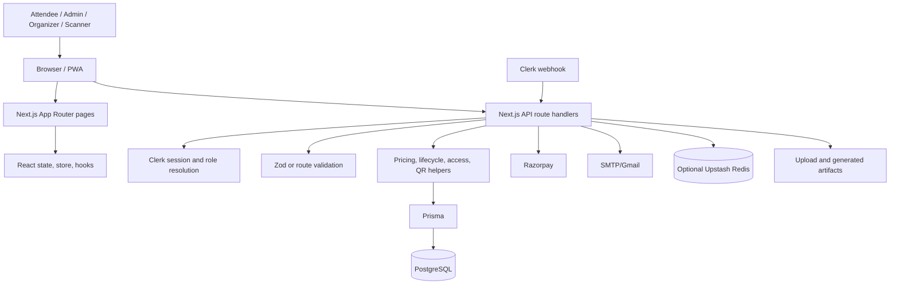

# EventHub — NotebookLM Master Project Source

This document is the consolidated, NotebookLM-ready source for the EventHub project in the `check_in_app` repository. It is intended to be uploaded together with the numbered project documents when asking NotebookLM to explain, teach, review, or prepare interview material about the project.

## How to use this source

Use this document as the narrative anchor and use the numbered documents as supporting detail. When answering, distinguish:

- **CONFIRMED:** directly supported by the current repository or generated documentation.
- **INFERENCE:** a reasonable architectural interpretation, not a measured production fact.
- **UNKNOWN:** not established by the current checkout and must not be presented as implemented.

Never invent production traffic, latency, coverage, payment receipts, email receipts, browser-auth results, database migrations, or provider configuration. Secrets are intentionally omitted.

## 1. Executive summary

EventHub is a single Next.js 16 App Router application for event discovery, registration, ticketing, payments, ticket delivery, QR-based attendee check-in, event operations, analytics, exports, reviews, certificates, promo codes, and audit records.

It is a **modular monolith**: pages, React components, server-side logic, API route handlers, domain helpers, and integration code live in one deployable Next.js application. PostgreSQL is the application data source of record and Prisma is the database access layer. Clerk supplies identity, sessions, and organization role signals. Razorpay handles payment order and payment verification flows. Nodemailer/SMTP handles optional email delivery. Upstash Redis provides optional distributed rate limiting. The browser can install the application as a PWA and supports an offline check-in queue.

The implemented objective is:

> Publish events → collect registrations → calculate prices and promos → create and verify payment → issue a tokenized ticket → deliver ticket/PDF/QR/email → scan and check in attendees → audit and analyze operations.

The current repository does **not** evidence an AI/LLM feature, vector database, RAG system, agent loop, queue worker, durable background job system, payment webhook, tracing/observability stack, or Prisma migration directory.

## 2. Problem and domain

Event operators need one workflow for public event information and internal operations. Without a unified system, event details, attendee records, payments, tickets, entry validation, and reports become disconnected.

Core vocabulary:

- **Event:** date, venue, capacity, pricing, schedule, registration configuration, speakers, sponsors, and tags.
- **Ticket:** an attendee registration with payment, delivery, cancellation/refund, and check-in state.
- **Session:** an event sub-session with time, speaker, capacity, and registration count.
- **Promo code:** a discount rule with usage records.
- **Check-in log:** an operational record associated with a ticket, including a checksum for tamper evidence.
- **Organizer assignment:** event IDs associated with a non-admin user.
- **SiteConfig:** singleton public-site configuration keyed by `default`.

## 3. Feature matrix

| Capability | Main entry points | Main implementation | Persistence or output |
|---|---|---|---|
| Public discovery | `/`, `/discover`, `/event/[id]`, `/p/[slug]` | App Router pages, `HomeClient`, events API | `Event`, `SiteConfig` |
| Event management | `/admin`, `/organizer` | Event forms/modals and event routes | `Event` |
| Registration and tickets | `/register`, event pages | `TicketForm`, ticket routes | `Ticket` |
| Razorpay payments | Checkout | Order and verify routes | Ticket payment fields |
| Promo codes | Admin and checkout | Promo routes and `lib/pricing.ts` | `PromoCodeRecord`, `PromoUsage` |
| QR ticket access | Ticket pages and artifact routes | QR/PDF/ICS routes and security helpers | `Ticket` |
| QR check-in | `/checkin` | `QRScanner`, check-in routes | `Ticket`, `CheckInLog` |
| Sessions and slots | Admin/organizer tabs | Session/slot routes and scheduler | `Session`, event JSON schedule |
| Attendee import | Admin/organizer operations | Import route and UI | `Ticket` |
| Analytics | Dashboards | Analytics routes/components | Aggregate database queries |
| Reviews | Event pages and organizer views | Review components/routes | `Review` |
| Certificates | Admin/organizer operations | Templates, generation, delivery | `CertificateTemplate`, ticket flag |
| Email and SMS | Ticket/certificate flows | Nodemailer and `sms.ts` | Delivery logs where used |
| Audit and security | Admin/check-in | Audit viewers and security helpers | `AuditLog`, `SecurityEvent` |
| PWA/offline | Browser install and check-in | `next-pwa`, manifest, offline hook | Client queue |

The repository does not justify claims of guaranteed email delivery, durable document processing, a separate venue entity, or a complete refund/payment-webhook lifecycle.

## 4. Technology and repository map

### Technology

- Next.js `^16.1.1` with App Router, SSR, and route handlers.
- React `^19.2.3` and TypeScript `^5`.
- Prisma `^6.19.1` with PostgreSQL.
- Clerk `@clerk/nextjs ^6.36.9` for identity, sessions, and organization roles.
- Razorpay `^2.9.6` for orders, payment lookup, and refund-related integration.
- Nodemailer `^7.0.12` for SMTP/Gmail delivery.
- Optional Upstash Redis and rate limiting.
- ZXing for QR/barcode scanning.
- `pdf-lib`/`jsPDF` for ticket and certificate output.
- Recharts for dashboard charts, Tailwind/PostCSS for styling, and `next-pwa` for PWA assets.

### Repository map

```text
app/                  App Router pages, layouts, API routes, boundaries
components/           Reusable UI, dashboards, forms, scanner, error states
hooks/                Browser behavior, including offline check-in
lib/                  Auth, Prisma, domain logic, security, integrations, exports
prisma/schema.prisma  PostgreSQL schema
prisma/seed.ts        Seed behavior
scripts/               Tests, environment checks, backfills, inspections
public/               Images, sounds, manifest, PWA/service-worker assets
proxy.ts              Clerk middleware and route redirects
next.config.ts        PWA and image configuration
vercel.json            Vercel/Next deployment configuration
```

Important code anchors are `proxy.ts`, `lib/auth.ts`, `lib/api-helpers/index.ts`, `lib/prisma.ts`, `prisma/schema.prisma`, `lib/pricing.ts`, `lib/ticket-lifecycle.ts`, `lib/ticket-access.ts`, `lib/ticket-security.ts`, `lib/qr-security.ts`, `app/api/tickets/route.ts`, `app/api/razorpay/verify/route.ts`, `app/api/checkin/route.ts`, `components/QRScanner.tsx`, `lib/store/index.tsx`, and `hooks/useOfflineCheckin.ts`.

## 5. System architecture



The normal request path is browser → page/component or API call → route handler → identity/role check → input validation → domain logic → Prisma transaction/query → optional external provider → JSON/page response.

There is no consistently separate service-class or repository layer. Some route handlers orchestrate directly against Prisma and providers. This is a modular monolith with useful domain helpers, not a strict clean-architecture implementation.

## 6. Authentication and authorization

Clerk is the identity provider. `proxy.ts` runs `clerkMiddleware`, fetches current Clerk user data, resolves organization role and public metadata, redirects protected pages, and adds `x-user-role` to permitted responses. `lib/auth.ts:getSession()` attempts local user synchronization and then falls back to Clerk data, returning a compatibility session containing ID, name, email, role, assigned events, and organization ID.

Clerk user-created and user-updated webhook events upsert local `User` rows; deleted events remove local rows. Password handling is delegated to Clerk. The schema’s local password field is not evidence of an active local password-login flow.

Roles are `ADMIN`, `ORGANIZER`/legacy `ORGANISER`, `SCANNER`, and `UNAUTHORIZED`.

- Admin has global event access.
- Organizer and scanner access is narrowed by assigned event IDs.
- `hasEventAccess()` centralizes event scoping.
- `authorizeTicketAccess()` allows a valid ticket token, the owning user, or an authorized event manager.
- Frontend visibility and middleware redirects improve UX but are not the API security boundary.
- Middleware deliberately allows API requests through; every API route must authorize itself.

Potentially sensitive routes requiring direct authorization review include email sending, ticket artifacts, transfer, promo validation, analytics, upload, payment-related routes, and webhook handling.

## 7. Principal user workflows

### Registration and payment

1. An attendee discovers an event through a public page.
2. Registration captures attendee data and optional custom answers.
3. `POST /api/tickets` creates pending ticket rows.
4. Promo validation and pricing calculate the payable amount.
5. `POST /api/razorpay/order` creates a Razorpay order when payment is required.
6. The browser completes payment.
7. `POST /api/razorpay/verify` validates required values, HMAC signature, payment/order status, ticket association, and frozen amount totals.
8. A transaction updates only pending tickets, conditionally increments `Event.soldCount`, records promo use, and generates the ticket token.
9. Email/PDF/QR delivery is attempted when configured.

Payment verification is browser/API initiated. No payment webhook was identified. Repeated verification is designed to recognize already-paid tickets, but full production idempotency guarantees are not evidenced.

Prices are represented as integer minor units; the current code treats event prices as paise and fixed pricing-rule UI values are multiplied by 100. Promo percentage discounts are clamped to 0–100%, fixed discounts are capped at subtotal, and `allocatePaidAmount()` distributes totals across tickets with any remainder assigned to earlier indices.

### Check-in

1. A scanner uses `components/QRScanner.tsx`.
2. `lib/scan-payload.ts` accepts an ID/token, URL, JSON, or timed QR format.
3. `POST /api/checkin` validates the ticket/token, timed QR signature and expiry, ticket lifecycle, role, and event assignment.
4. A transaction updates `Ticket.checkedIn` and creates a `CheckInLog` with a checksum.
5. The scanner shows success, duplicate, invalid, or error feedback.

`hooks/useOfflineCheckin.ts` provides a client-side queue for offline behavior. The server remains authoritative when synchronization occurs. A checked-in ticket is a paid-like ticket with `checkedIn=true`; it is not a separate ticket lifecycle status.

### Event operations

An admin or organizer submits an event form → event route checks role and event ownership → fields are validated → Prisma writes `Event` → public pages and dashboards read the result. Schedules, speakers, sponsors, tags, and registration fields are stored in JSON or array fields rather than all being normalized child tables.

### Ticket delivery, exports, and certificates

After ticket settlement, email/PDF/QR/ICS helpers produce attendee artifacts. SMTP/Nodemailer sends email when configured. Export and certificate operations query authorized events/tickets and return CSV/PDF or attempt email delivery. Failure behavior is route-specific and best-effort; email failure does not roll back a successful payment.

## 8. Data model

The schema contains 15 models: `AuditLog`, `User`, `Event`, `PricingRule`, `Review`, `Session`, `SiteConfig`, `Ticket`, `CheckInLog`, `TicketDeliveryLog`, `SecurityEvent`, `PromoCodeRecord`, `PromoUsage`, and `CertificateTemplate`.

`Event` is the central aggregate. Users organize events and own tickets. Events contain tickets, sessions, reviews, pricing rules, promo applicability, and optional certificate templates. Tickets contain payment, access, delivery, and check-in information. Check-in and delivery logs attach to tickets. `SiteConfig` is a singleton. Schedules, speakers, sponsors, registration fields, and certificate elements use JSON; tags and assigned/event IDs use PostgreSQL arrays.

Strengths include relational ownership, cascading log relationships, and indexes on event/status/time, ticket lookup, audit, and log access paths. Tradeoffs include weaker relational constraints and more difficult reporting for JSON/array-heavy fields.

The repository documents `prisma db push` and has a seed script, but no Prisma migrations directory. Versioned schema rollout and safe production migration evidence are therefore **UNKNOWN**.

## 9. API surface

Key public or token-authorized flows include:

```text
GET  /api/analytics
POST /api/promo/validate
POST /api/razorpay/order
POST /api/razorpay/verify
GET  /api/tickets/[id]
GET  /api/tickets/[id]/qr
GET  /api/tickets/[id]/pdf
GET  /api/tickets/[id]/ics
POST /api/tickets/transfer
```

Authenticated/admin/organizer flows include user/session, events, sessions, slots, duplication, export, tickets, cancellation, delivery, refund, check-in, audit, attendee import, reviews, settings, analytics, uploads, and admin operations.

The complete route inventory is in `09-api-reference.md`. Important route families are:

- `/api/admin/*`: dashboard, tickets, audit logs, Clerk users, scanners, promo codes, pricing rules, certificates.
- `/api/events/*`: event CRUD, sessions, slots, duplication, export.
- `/api/tickets/*`: creation, lookup, artifacts, bulk actions, cancel, deliver, refund, transfer.
- `/api/checkin/*`: check-in, bulk check-in, audit, audit export.
- `/api/analytics/*`: dashboard, cohort, funnel.
- `/api/webhooks/clerk`: verified Clerk synchronization webhook.

Expected status conventions are 400 validation, 401 unauthenticated, 403 unauthorized, 404 missing resource, 409 capacity/order conflict, 429 rate limited, and 500 configuration/unexpected error. Exact request fields are route-specific and should be read from the route and `lib/api-helpers/schemas.ts` before changing a client.

## 10. Security posture and findings

### Controls confirmed

- Clerk identity and server-side role resolution.
- Zod/API helper parsing and standardized known-error responses.
- HMAC ticket tokens and timed QR payloads.
- Timing-safe signature comparisons.
- Razorpay signature, payment status, order association, and amount checks.
- HMAC check-in/audit checksums.
- Optional Upstash sliding-window rate limiting.
- Production requirement for a strong `TICKET_SECRET_KEY`.

### Findings requiring remediation or targeted verification

1. Review `app/api/email/send/route.ts` and `app/api/email/send-certificate/route.ts` for caller authorization, recipient control, and abuse limits.
2. The timed-QR HMAC is truncated to 16 hexadecimal characters; a full digest or explicit threat-model decision would be stronger.
3. The deterministic development ticket secret must never be used outside local development.
4. Missing Upstash variables disable optional rate limiting, so deployment configuration matters.
5. Audit upload type, size, content validation, and durable storage behavior.
6. Verify transfer authorization and replay behavior.
7. Treat logs and provider errors as potentially sensitive.

These are static-review findings, not confirmed production exploits. No runtime-confirmed application bug was established by this documentation pass.

## 11. Integrations, async behavior, and reliability

| Service | Purpose | Failure behavior |
|---|---|---|
| Clerk | Identity, sessions, organization roles, webhook sync | Lookup/session errors become null or route errors; webhook errors return 400 |
| Razorpay | Orders, payment lookup, refund-related calls | Route returns an error; settlement is guarded by verification and transaction logic |
| SMTP/Gmail | Ticket and certificate email | Best-effort warnings/logs; delivery records exist in relevant paths |
| Upstash Redis | Optional throttling | Throttling is disabled when variables are missing |
| Fast2SMS | Optional SMS helper | Depends on `lib/sms.ts` and configuration |
| Vercel | Hosting/deployment | Provider behavior is not proven by repository configuration alone |

No queue, worker, cron handler, pub/sub consumer, dead-letter flow, circuit breaker, durable retry queue, or disaster-recovery procedure was identified. `CRON_SECRET` appears as recommended configuration, but a cron implementation is not established. Email, certificates, PDFs, and analytics appear request-triggered.

The strongest reliability boundary is the database transaction around payment settlement and check-in. The web layer is mostly stateless and therefore horizontally deployable in principle, but PostgreSQL, database connections, external quotas, offline queues, and request-bound document/email generation are constraints.

Likely pressure points at higher usage are dashboard aggregation, exports/imports, JSON queries, repeated Clerk lookups, concurrent capacity updates, email/PDF generation, provider rate limits, and audit volume. No benchmark, throughput, latency, or load-test number is available.

## 12. Testing and validation

`npm test` runs `scripts/run-tests.ts` and covers scan payload formats, ticket HMACs, timed-QR validity and tampering, time-slot validation/merge, early-bird/dynamic/promo pricing, amount allocation, API JSON/Zod parsing, and ticket lifecycle financials.

`npm run ci` chains tests, typecheck, lint, and build. The repository does not provide a dependable coverage percentage, browser E2E suite, database integration suite, security suite, performance benchmark, or Razorpay contract suite.

Highest-value additions are:

- authorization matrix tests for every role and event assignment;
- payment verification, repeated requests, capacity concurrency, and gateway failure tests;
- check-in duplicate, expiry, tampering, and offline synchronization tests;
- upload validation and storage tests;
- email failure and delivery-log tests;
- browser E2E coverage for sign-in, registration, payment, ticket access, and check-in.

## 13. Deployment and configuration

`vercel.json` identifies a Next.js/Vercel deployment in region `sin1`. `next.config.ts` enables production PWA output to `public` and remote HTTP/HTTPS images. Prisma generation runs during dependency installation through the package scripts.

Required variables:

```text
POSTGRES_PRISMA_URL
DATABASE_URL
NEXT_PUBLIC_CLERK_PUBLISHABLE_KEY
CLERK_SECRET_KEY
```

Recommended variables include `TICKET_SECRET_KEY`, `CRON_SECRET`, `RAZORPAY_KEY_ID`, `RAZORPAY_KEY_SECRET`, and `NEXT_PUBLIC_RAZORPAY_KEY_ID`.

Optional variables include SMTP/Gmail settings, Upstash REST URL/token, `FAST2SMS_API_KEY`, `NEXT_PUBLIC_APP_URL`, and `NEXT_PUBLIC_BASE_URL`.

Environment names may be documented; actual values must never be copied into this source. Repository readiness is not the same as live deployment proof. A trustworthy release claim should separately verify build, deployment status, canonical routes, unknown-route behavior, auth boundaries, provider configuration, database reachability, and real external delivery.

## 14. Safe extension guide

For a new API: add the route → validate input → enforce role and event ownership → use domain helpers/Prisma → preserve status and JSON conventions → add the client caller → add focused tests.

For a new entity: update the schema → adopt a real versioned migration workflow before production → add relations/indexes → query logic → route → validation → UI → tests and justified seed data.

For a new page: use the correct App Router and role shell → provide loading, error, and empty states → protect direct navigation and API access independently → test the direct URL.

Do not change payment, capacity, role, token, or check-in logic without transaction/security regression tests.

## 15. Roadmap and technical debt

Priority 1: establish Prisma migrations and deployment procedure; add route authorization/integration tests; audit public-ish email, ticket, and transfer endpoints; strengthen QR digest and rate-limit guarantees.

Priority 2: move email/PDF/certificate work to durable jobs; standardize API validation/error handling; centralize ticket settlement and authorization; improve observability, timeouts, and provider failure handling.

Priority 3: normalize heavily queried JSON/array fields where reporting needs it; add E2E, load, disaster-recovery, data-retention, and production-topology documentation.

## 16. Learning path

Study the project in this order:

1. Follow one ticket from registration through payment, delivery, and check-in.
2. Learn App Router pages, layouts, server/client boundaries, and route handlers.
3. Study `lib/api-helpers` and Zod validation.
4. Study Prisma relations, indexes, and transactions in `prisma/schema.prisma` and payment/check-in routes.
5. Study Clerk identity, organization roles, metadata, and local user synchronization.
6. Study `lib/pricing.ts` and `lib/ticket-lifecycle.ts`.
7. Study HMAC ticket/QR integrity and `components/QRScanner.tsx`.
8. Study Razorpay, email, SMS, Upstash, exports, certificates, and failure paths.
9. Study tests, PWA behavior, deployment, and debugging.
10. Propose improvements only after separating confirmed behavior from desired future architecture.

## 17. Viva and interview defense

The concise defense is:

> EventHub uses a modular Next.js monolith so event operations, APIs, and UI can be developed and deployed as one coherent application. Clerk handles identity and role signals, while PostgreSQL remains the application data authority. Prisma provides typed persistence. Payment settlement and check-in use validation, integrity checks, and transactions. Email and document delivery are currently best-effort and request-triggered, not queue-backed. The repository does not evidence AI, payment webhooks, migrations, durable workers, or production observability, so those should be described as future work or unknown rather than implemented features.

Likely questions:

1. Why is this a modular monolith?
2. Where is role enforcement performed?
3. Why does middleware pass API routes through?
4. How is organizer event access scoped?
5. What makes a ticket eligible for check-in?
6. How does HMAC protect ticket and QR data?
7. Why is timed QR expiry used?
8. How does payment verification resist forged callbacks?
9. How is capacity protected under concurrent purchases?
10. What happens when payment verification repeats?
11. How are promo discounts allocated?
12. What happens when SMTP fails after payment succeeds?
13. What data belongs in Clerk versus PostgreSQL?
14. Why use JSON and arrays in the schema?
15. What happens when Upstash is not configured?
16. Why is frontend hiding an admin control insufficient?
17. What tests exist and what is missing?
18. What would become a bottleneck at 10x or 100x usage?
19. How would you add a new event-related API?
20. Is there an AI feature, and what repository evidence supports the answer?
21. Why is `prisma db push` weaker than migrations for production?

When answering, cite concrete files such as `proxy.ts`, `lib/auth.ts`, `lib/clerk-role-utils.ts`, `prisma/schema.prisma`, `lib/pricing.ts`, `lib/ticket-security.ts`, `lib/qr-security.ts`, `app/api/tickets/route.ts`, `app/api/razorpay/verify/route.ts`, `app/api/checkin/route.ts`, `scripts/run-tests.ts`, `next.config.ts`, and `vercel.json`.

## 18. NotebookLM ready-to-paste study script

Paste the following instruction into NotebookLM after uploading this master source and the numbered documents:

```text
You are my EventHub project mentor and viva examiner. Use only the uploaded EventHub sources. Treat current repository evidence as authoritative. For every answer:

1. Start with a direct answer in plain language.
2. Label important claims CONFIRMED, INFERENCE, or UNKNOWN.
3. Cite the relevant document and code path when available.
4. Do not invent AI, queues, webhooks, migrations, benchmarks, coverage, production receipts, or live-provider results.
5. If the source is silent or contradictory, say so explicitly.
6. Explain both how the current implementation works and how it could be improved.

Study mode:
- Teach one concept at a time.
- Use the ticket lifecycle as the running example.
- After each explanation, ask me one short check question.
- Correct imprecise claims and distinguish frontend behavior from server authorization.

Viva mode:
- Ask one question at a time, starting from beginner and progressing to system design.
- Wait for my answer before revealing the model answer.
- Grade each answer from 0–5 for correctness, evidence, clarity, and honesty about limits.
- Follow weak answers with a concrete code-path question.

Code-review mode:
- Trace a route from browser entry point to validation, authorization, domain helper, database operation, provider call, response, and failure behavior.
- Identify security, concurrency, reliability, and scalability risks.
- Never call a static-review concern a confirmed exploit without runtime evidence.

Begin by asking whether I want Study mode, Viva mode, or Code-review mode. If I do not choose, begin with a five-minute executive explanation of EventHub and then explain registration → payment → ticket → QR check-in.
```

## 19. Source register

This master consolidates the following generated documents. Keep them uploaded to NotebookLM when detailed traceability is needed:

```text
00-project-overview.md       01-problem-and-objectives.md
02-features.md               03-tech-stack.md
04-repository-structure.md   05-system-architecture.md
06-frontend-architecture.md 07-backend-architecture.md
08-database.md               09-api-reference.md
10-authentication.md         11-authorization.md
12-security-audit.md         13-data-flows.md
14-ai-architecture.md        15-integrations.md
16-background-jobs.md         17-state-management.md
18-error-handling.md          19-testing.md
20-performance.md             21-scalability.md
22-reliability.md             23-deployment.md
24-configuration.md           25-code-quality.md
26-bug-audit.md               27-technical-debt.md
28-debugging-guide.md         29-extension-guide.md
30-learning-roadmap.md        31-viva-questions.md
32-interview-questions.md     33-project-cheat-sheet.md
MASTER_PROJECT_DOCUMENTATION.md
PROJECT_CHEAT_SHEET.md
EVENTHUB_COMPLETE_PROJECT_DOCUMENTATION.docx
```

The numbered Markdown files provide focused source detail. `MASTER_PROJECT_DOCUMENTATION.md` is the earlier consolidated audit. `PROJECT_CHEAT_SHEET.md` is the short revision aid. The DOCX is the document-form version of the project documentation. This file is the NotebookLM-oriented narrative and prompt layer.

## 20. Final confidence boundary

Confirmed from the current documentation and repository audit: project purpose, major features, architecture shape, role model, data model, route families, ticket/pricing/check-in logic, security controls, configuration names, test commands, and known limitations.

Not confirmed by this source alone: current production credentials, live database contents, real email/SMS receipt, fresh browser authentication, provider dashboard state, measured performance, migration execution, durable storage behavior, and absence of every possible runtime bug.
